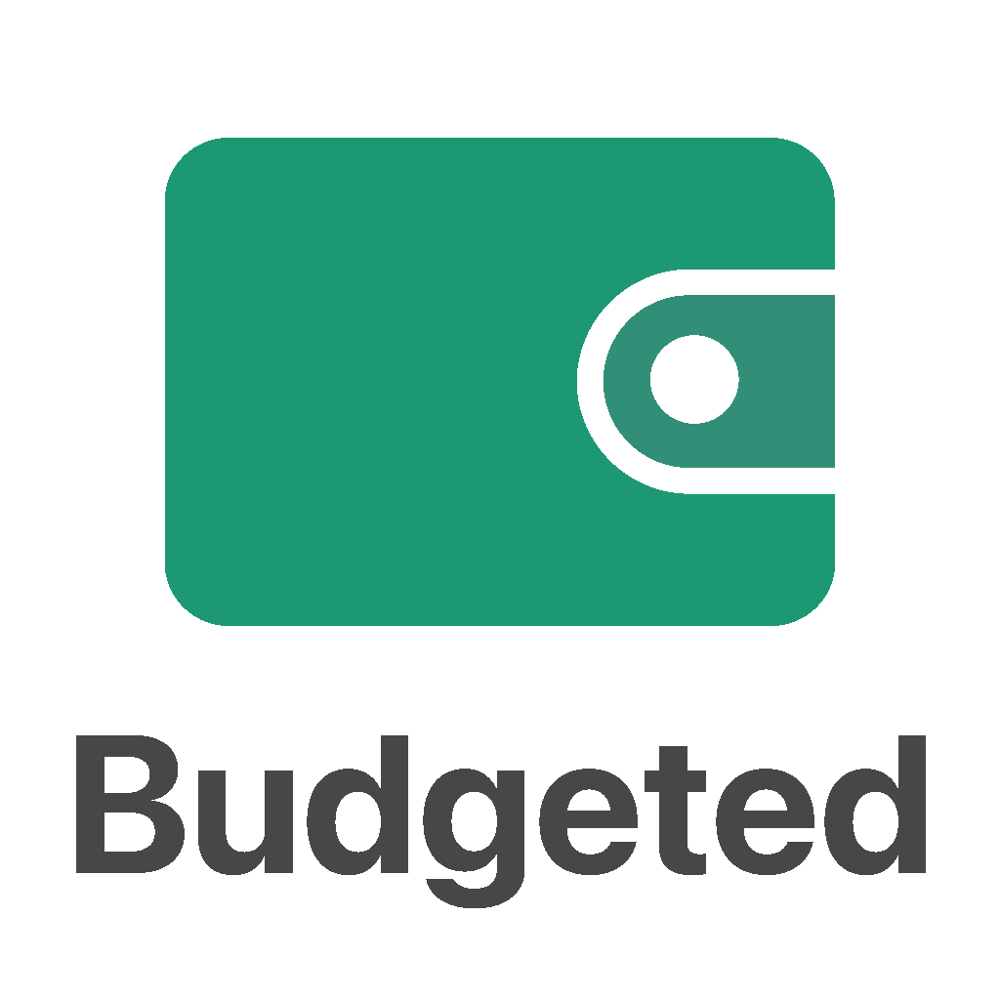

# Budgeted

Budgeted allows you to create multiple budgets, check and manage them on the go at a glance. The data will be safely stored in the cloud and can be retrieved on multiple devices at any time using your user account.
 
 
Budgeted is being developed using Swift, UIKit and the MVC pattern.
 
Features a fully programmatic UI,  Onboarding Experience, Sign up/Login and Cloud Storage functionality using Google Firebase, Custom Modals, Animated Horizontal and Circular Progress Bars using CAShape Layers, AE loading animation using Lottie and Keychain integration.
